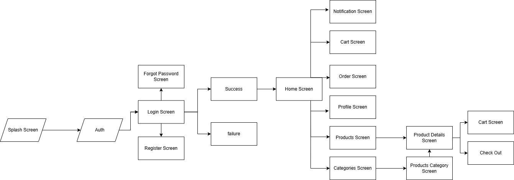

# Colt Ecommerce App

A modern Flutter-based e-commerce application designed with clean architecture, Cubit/BLoC state management, and a responsive UI.

---

## Application Life Cycle

---

## Features

- Modern and clean user interface (Dark and Light mode)
- Product browsing with categories and search
- Favorites and cart management
- State management using Cubit/BLoC
- Persistent cart saved locally
- Product details page with images and descriptions
- Checkout simulation with order summary
- REST API integration (can connect to backend or dummy API)

---

## Tech Stack

- Flutter – UI Framework  
- Dart – Programming Language  
- Cubit/BLoC – State Management  
- Hive / Shared Preferences – Local Storage  
- REST API / JSON – Data Handling  

---

## Notes

This app is a practical project for learning Flutter architecture, state management, and feature-based structure in real-world e-commerce development.

---

## Author

**Abdelrhman Nada**  
Flutter Developer
