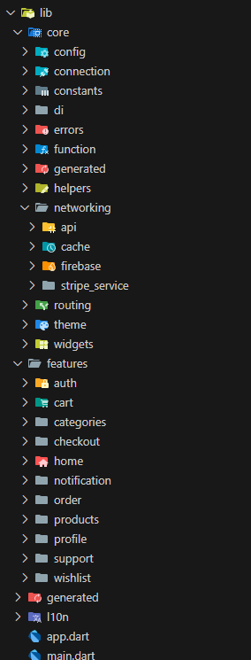

# Colt-Ecommerce-App


🎥 [Watch App Demo]([https://www.dropbox.com/s/<share-id>/ecommerce_app.mp4?raw=1](https://www.dropbox.com/home?preview=ecommerce_app.mp4))




A modern Flutter-based e-commerce application designed with clean architecture, state management, and responsive UI.

## Key Features & Benefits

*   **Clean Architecture:** Designed with a focus on separation of concerns, making the codebase maintainable and scalable.
*   **State Management:** Implements robust state management solutions (e.g., Provider, BLoC, Riverpod - *Implementation details to be added later*).
*   **Responsive UI:** Adapts seamlessly to various screen sizes and devices, providing a consistent user experience.
*   **Modern Design:** Features a visually appealing and user-friendly interface.
*   **Product Catalog:** Browse and search through a wide range of products.
*   **Shopping Cart:** Add, remove, and manage items in your shopping cart.
*   **Checkout Process:** Secure and straightforward checkout process.
*   **User Authentication:** User registration, login, and profile management.
*   **Order History:** Track your past orders and purchase history.

## Prerequisites & Dependencies

Before you begin, ensure you have the following installed:

*   **Flutter SDK:**  [Install Flutter](https://flutter.dev/docs/get-started/install)
*   **Dart SDK:**  (Included with Flutter)
*   **Android Studio/VS Code:**  IDE for development.
*   **Git:**  For version control.
*   **Kotlin:** Required for native Android code (dependencies handled by Flutter/Gradle)
*   **Swift:** Required for native iOS code (dependencies handled by Flutter/Cocoapods)

## Installation & Setup Instructions

1.  **Clone the repository:**

    ```bash
    git clone https://github.com/Abdelrhman-Tec/Colt-Ecommerce-App.git
    cd Colt-Ecommerce-App
    ```

2.  **Install dependencies:**

    ```bash
    flutter pub get
    ```

3.  **Run the application:**

    ```bash
    flutter run
    ```

    Choose the target device (Android emulator, iOS simulator, or connected device).

4.  **iOS Setup (if applicable):**

    *   Navigate to the `ios` directory: `cd ios`
    *   Install Cocoapods dependencies: `pod install`
    *   Open the Xcode workspace: `open Runner.xcworkspace`
    *   Select your development team in the "Signing & Capabilities" tab.
    *   Run the app from Xcode or using `flutter run`.

## Usage Examples & API Documentation (if applicable)

*This section will be populated with specific examples demonstrating how to use different features and API endpoints, once the backend integration is complete.*

## Configuration Options

*This section will detail configuration options for backend services and any environment variables needed for different deployment environments.*

## Contributing Guidelines

We welcome contributions from the community! To contribute:

1.  Fork the repository.
2.  Create a new branch for your feature or bug fix: `git checkout -b feature/your-feature-name`
3.  Make your changes and commit them with descriptive messages.
4.  Push your branch to your forked repository: `git push origin feature/your-feature-name`
5.  Submit a pull request to the `main` branch of the original repository.

Please follow these guidelines:

*   Write clear and concise code.
*   Provide tests for your changes.
*   Adhere to the existing code style.
*   Document your code thoroughly.

## License Information

*License information will be added here upon project completion.*

## Acknowledgments

*We would like to thank the Flutter community and the developers of various open-source libraries that made this project possible. Specific acknowledgments to be added here.*
